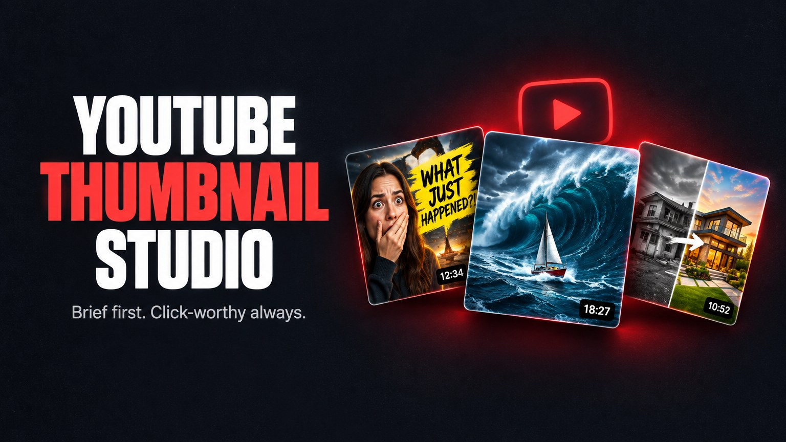

<p align="center">
  
</p>

# YouTube Thumbnail Studio — high-CTR thumbnails for Claude Code and Codex

<p align="center">
  
  
  
  
  
  
</p>

**Your agent becomes a thumbnail studio.** A strategist reads your niche, an art director pitches three concepts with
real click drivers, a brief writer locks the layout, palette and text — and only then the AI artist generates.
A retoucher, a typographer and a CTR check finish the job, and you get a Test & Compare plan.

Most AI thumbnails fail for one reason: they are *clean and pretty*. Nobody clicks pretty. This skill refuses to
generate until every concept has a reason to click — emotion, intrigue, awe, stakes or proof — taken from your video.

Once installed, just ask:

- "Make 3 high-CTR thumbnail concepts for my video about [topic]"
- "Write the thumbnail brief before we generate anything"
- "Redo this thumbnail — it has no emotion"
- "Check my thumbnail at feed size next to real competitors"
- "Make a 9:16 cover for my Short"

## How it works

| # | Role | What happens |
|---|---|---|
| 1 | Strategist | the video's promise, the viewer's desire loop, the main search query |
| 2 | Feed researcher | real competitors in your feed and outliers (views ≫ subscribers) — their visual grammar |
| 3 | Art director | 3 concepts with **different click drivers**: awe, story, open question, before → after, proof |
| 4 | Brief writer | layout map in %, HEX palette, exact text, light, risks — **you approve the brief** |
| 5 | Photo editor | picks your real frames and photos: peak emotion, big face |
| 6 | AI artist | 4-part prompts, ordered references, 2–4 variants per concept, a 2×2 comparison |
| 7 | Retoucher | background, sky, light, clutter, cut-outs, 4K upscale — your face is never altered |
| 8 | Typographer | the exact words in your brand font, composited — no melted AI lettering |
| 9 | CTR QA | 120 px / 168×94 / 320×180 tests, safe zones, dark + light feed mock, stranger test, truth check |
| 10 | Test | YouTube Test & Compare plan: 3 thumbnails, backup pair, when to swap |

## Image engine: Woso

Generation runs through **[Woso](https://woso.io/r/LVDWNDGMS)** — an AI aggregator with a single MCP connector to the models
that matter for thumbnails:

| Model | Used for |
|---|---|
| Nano Banana Pro | finals: photoreal edits of your real frames, 2K/4K, keeps faces |
| Nano Banana 2 / Nano Banana | fast concept variants and iterations |
| GPT Image 2.5 | poster layouts, graphics, text in frame |
| Seedream 4.5 / 5 Lite | backgrounds and restyles |
| Background removal, Topaz upscale | cut-outs and 4K masters |

One balance, no API keys to juggle, and the same connector works in Claude, Claude Code, Codex, Cursor and ChatGPT.
**[Get Woso →](https://woso.io/r/LVDWNDGMS)** (MCP is included in plans with assistants and agents).

## Free credits to try it
New to Woso? Sign up with **[this link](https://woso.io/r/LVDWNDGMS)** and enter promo code **`LVDWNDGMS`** on the balance page —
you get free credits for your first 2–3 test thumbnails. Use them in the Woso web app right away, or through the
MCP connector once your plan includes MCP.

## Install

### 1. Add the skill

**Claude Code**
```
/plugin marketplace add Lovedevandgames/youtube-thumbnail-studio
/plugin install youtube-thumbnail-studio@youtube-thumbnail-studio
```

**claude.ai / Claude Desktop** — Settings → Skills → **Add from GitHub** → `Lovedevandgames/youtube-thumbnail-studio`

**Codex CLI**
```bash
codex plugin marketplace add Lovedevandgames/youtube-thumbnail-studio
codex plugin add youtube-thumbnail-studio@youtube-thumbnail-studio
```

**Any agent (skills CLI)**
```bash
npx skills add Lovedevandgames/youtube-thumbnail-studio
```

**Or just paste the repo link to your agent:** "Install the skill from https://github.com/Lovedevandgames/youtube-thumbnail-studio".

### 2. Connect Woso (2 minutes)
1. Open **woso.io/profile/api** and copy your MCP link from **Connect Claude**.
2. Claude: **Settings → Connectors → Add custom connector** → paste the link.
   Claude Code: `claude mcp add --transport http --scope user woso '<your link>'`.
   Codex / Cursor / others: use the one-click install on the same page.
3. New chat → "Generate a test 16:9 image with Woso". A link in ~20 seconds means you're ready.

Your link contains a private token — never commit or share it. Full guide:
[`references/07-connect-woso.md`](skills/youtube-thumbnail-studio/references/07-connect-woso.md).

### 3. Optional: local QA scripts
```bash
pip install -r requirements.txt
```

## What's inside

```
skills/youtube-thumbnail-studio/
├── SKILL.md                      # the workflow and the three laws
├── references/
│   ├── 01-click-psychology.md    # thumbnail → title → thumbnail, click drivers, 7 scroll-stoppers, emotions
│   ├── 02-brief-template.md      # the brief you approve before any generation
│   ├── 03-prompts.md             # model choice, 4-part prompts, edits, real-people rules
│   ├── 04-design-rules.md        # sizes, safe zones (16:9 and 9:16), colour, text, background
│   ├── 05-qa-and-testing.md      # acceptance checklist, A/B and Test & Compare
│   ├── 06-woso-engine.md         # tools, models and service rules
│   └── 07-connect-woso.md        # connection guide for users
└── scripts/
    ├── feed_mock.py              # your thumbnails among real YouTube results, dark + light
    ├── check.py                  # 120 px / 168×94 / 320×180 previews + safe-zone overlay
    ├── grid.py                   # 2×2 comparison of variants
    └── compose_text.py           # exact text in your brand font + duration-zone check
```

## The three laws
1. **Brief first, model second.** Nothing is generated until you approve the brief.
2. **"Clean and pretty" is a fail.** Every thumbnail needs a reason to click.
3. **Truth.** The thumbnail only promises what the video delivers; real faces are never altered without consent.

## Credits
Distilled from the best open-source thumbnail skills and research — inference-sh `youtube-thumbnail-design`,
`thumbnail-engine`, `viral-agent-1of10`, `claude-video-thumbnail-skill`, `youtube-skills` (`yt-thumbnail-brief`),
vidIQ breakout data and YouTube Help. See [`references/sources.md`](skills/youtube-thumbnail-studio/references/sources.md).

> Found it useful? **Star the repo** — directories rank skills by stars, so that's how the next creator finds it.

MIT License.
